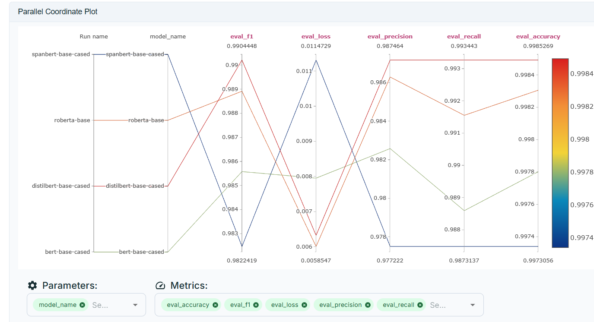

# Job Skill Extractor & Resume Matching Engine

An end-to-end NLP project for extracting skills from job descriptions, parsing resumes, and building a recommendation engine to match candidates with job-specific skill profiles.

---

## Contents

- [Step 1: Data Acquisition (Web Scraping)](#step-1-data-acquisition-web-scraping)
- [Step 2: ETL Data Preprocessing Pipeline](#step-2-etl-data-preprocessing-pipeline)
- [Step 3: Model Training](#step-3-model-training)
- [Step 4: Model API](#step-4-model-api)
- [Step 5: Recommendation Engine](#step-5-recommendation-engine)
- [Step 6: Deployment & Web UI](#step-6-deployment-web-ui)

---

## Step 1: Data Acquisition (Web Scraping)

The project began by building a high-quality dataset of job descriptions.  
A custom web scraping script was developed to collect postings from various job portals using the following job titles:

- Data Analyst
- Data Engineer
- Data Scientist
- Machine Learning Engineer
- Cloud Engineer
- Cybersecurity Analyst
- Full Stack Developer
- Software Developer
- DevOps Engineer
- Database Administrator

This process resulted in **4,429 raw job descriptions**, stored in JSON format.  
This dataset serves as the foundation for training the Named Entity Recognition (NER) model used for skill extraction.

---

## Step 2: ETL Data Preprocessing Pipeline

A robust, three-stage ETL pipeline was developed to prepare the raw data for model training, ensuring the final dataset is clean, balanced, and accurately labeled.

**Extract:** The pipeline reads raw job description data from the `data/raw` directory.

**Transform:** Modular scripts clean the text, perform sentence segmentation, and apply BIO-tagging based on a comprehensive list of technical and soft skills. To address data imbalance and prevent model bias, oversampling techniques duplicate sentences from underrepresented job roles.

**Load:** The processed dataset, formatted for model training, is saved to the `data/processed` directory.

This ETL pipeline ensures the model is trained on high-quality data, which is crucial for accurate and generalized skill extraction.

---

## Step 3: Model Training

Trained and evaluated **four Transformer models** for job skill Named Entity Recognition (NER):

- **BERT-base-cased**
- **DistilBERT-base-cased**
- **RoBERTa-base**
- **SpanBERT-base-cased**

### Setup

- **Training**: 2–4 epochs on Colab T4 GPU
- **Framework**: HuggingFace Transformers (Trainer API)
- **Tracking**: MLflow + DagsHub (metrics, hyperparameters, artifacts)
- **Evaluation**: Precision, Recall, F1, Accuracy, Loss
- **Post-processing**: Subword merge + Hybrid Dictionary Lookup (to reduce fragmentation and catch unseen skills)

---

### Results

| Model                     | Eval Accuracy |    Eval F1 | Eval Precision | Eval Recall |   Eval Loss |
| ------------------------- | ------------: | ---------: | -------------: | ----------: | ----------: |
| **BERT-base-cased**       |        0.9978 |     0.9856 |         0.9826 |      0.9886 |     0.00796 |
| **DistilBERT-base-cased** |    **0.9985** | **0.9902** |     **0.9872** |  **0.9933** |     0.00633 |
| **RoBERTa-base**          |        0.9983 |     0.9889 |         0.9863 |      0.9916 | **0.00601** |
| **SpanBERT-base-cased**   |        0.9973 |     0.9825 |         0.9775 |      0.9875 |     0.01131 |

---

### Visualization

Parallel coordinates comparing the four models across metrics:

_(Generated in DagsHub via MLflow experiment tracking.)_

---

### Conclusion

- **Best Overall F1 & Recall:** DistilBERT-base-cased
- **Cleanest Entities in Inference:** BERT-base-cased (less token fragmentation)
- **Close Runner-up:** RoBERTa-base (needs better BPE merging logic)
- **De-prioritized:** SpanBERT-base-cased (slightly weaker on this dataset)

**Final choice:**

- **Production model:** **BERT-base-cased** (balanced metrics + cleaner span predictions, easier downstream use).
- **Fast mode / backup:** DistilBERT-base-cased (best F1/recall, lightweight, faster inference).

---

### What’s Next

With the best model chosen, the next phase is to **wrap it into an API** and integrate the  
**Hybrid Dictionary Lookup** module during inference. This ensures high recall by combining  
deep learning with rule-based coverage of domain-specific skills.
